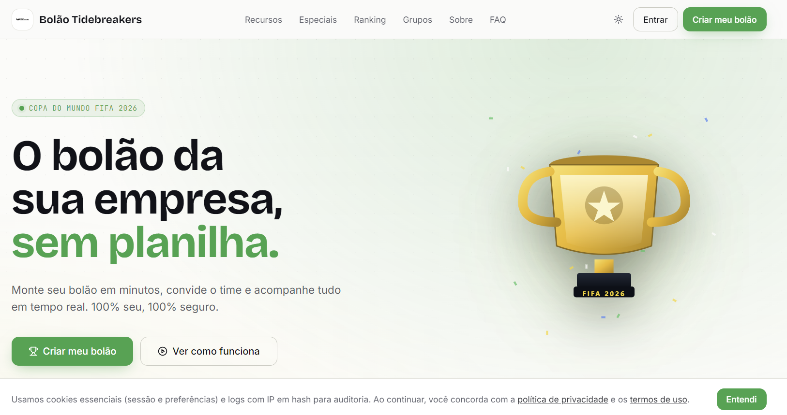
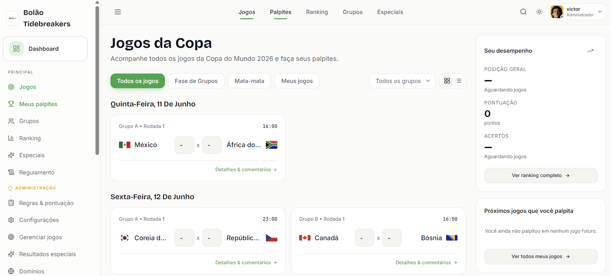
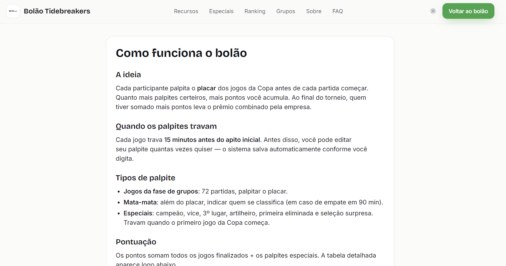

# Bolão Copa do Mundo 2026

Plataforma open-source de bolão corporativo para a Copa do Mundo FIFA 2026. Pensada pra empresas usarem como ferramenta de endomarketing — single-tenant, white-label, e instalável em poucos cliques na sua própria conta Cloudflare.

Sem cobrança de mensalidade, sem SaaS, sem dados saindo da sua infra: você cria o seu fork, faz o deploy na sua Cloudflare, e usa.

Projeto desenvolvido pela [**Tidebreakers**](https://tidebreakers.com.br/) — ecossistema digital que vai além do modelo tradicional de agências e consultorias, unindo criativo, mídia, tecnologia e dados pra transformar desafios em resultados reais. Se a sua empresa quer um endomarketing que engaja de verdade (ou qualquer outra operação digital com transparência e ROI comprovado), [fala com a gente](https://tidebreakers.com.br/).

[](https://deploy.workers.cloudflare.com/?url=https://github.com/victorrm/bolao-copa-do-mundo)

## Screenshots

| Landing white-label | Jogos & palpites | Regras públicas |
|---|---|---|
|  |  |  |

## Sumário

- [Screenshots](#screenshots)
- [Por que usar](#por-que-usar)
- [Funcionalidades](#funcionalidades)
- [Stack](#stack)
- [Roadmap](#roadmap)
- [Comunidade](#comunidade)
- [Custos (gratuito + tier Cloudflare)](#custos)
- [Self-hosting](#self-hosting)
  - [Cloudflare (1 clique)](#cloudflare-1-clique)
  - [Primeiro acesso superadmin](#primeiro-acesso-superadmin)
  - [Bootstrap manual via CLI](#bootstrap-manual-via-cli)
  - [Como emitir a API key do Resend (opcional)](#como-emitir-a-api-key-do-resend-opcional)
  - [Como emitir a API key da Football-Data](#como-emitir-a-api-key-da-football-data)
- [Desenvolvimento local](#desenvolvimento-local)
- [Contribuindo](#contribuindo)
- [Licença](#licenca)

## Por que usar

- **Open source e auto-hospedável.** Você é o dono dos dados.
- **Sem mensalidade.** Roda no free tier da Cloudflare pra empresas até ~10k funcionários ativos.
- **Single-tenant por design.** Cada empresa instala sua própria cópia — dados nunca cruzam entre instâncias.
- **White-label.** Logo, cores, regras, prêmios e domínios permitidos são configuráveis pelo painel admin, sem mexer em código.
- **LGPD/GDPR ready.** Consentimento explícito, exportação de dados, direito ao esquecimento.
- **Foco em endomarketing**, não em aposta financeira. A plataforma nunca movimenta dinheiro — premiação é definida e entregue pela empresa.

## Funcionalidades

- **Login por email + senha** com cadastro restrito aos domínios corporativos liberados pelo admin (1º cadastro libera o próprio domínio automaticamente).
- **Palpites de placar** pra todos os 104 jogos (fase de grupos + mata-mata até a final).
- **Palpites especiais pré-Copa**: campeão, vice, 3º, artilheiro, primeira eliminada e seleção surpresa.
- **Sistema de pontuação** com placar exato (3pts), vencedor correto (1pt) e bônus de mata-mata.
- **Ranking geral, por rodada e por grupo privado**, com indicadores de subida/queda.
- **Grupos privados** ("turma do RH", "amigos da TI") com convite por link.
- **Painel superadmin completo**: domínios, regras, prêmios, usuários, jogos, recálculo, broadcast por email, auditoria.
- **Gamificação**: badges (🔮 Tarólogo, 🔥 Sequência Quente, 🐓 Madrugador, etc.).
- **Cards compartilháveis** (OG images) gerados via Worker pra LinkedIn, Slack, Teams, WhatsApp.
- **PWA mobile-first** com modo escuro.
- **i18n** preparado pra pt-BR, en e es.
- **Editor de regras e prêmios** customizável pelo admin.
- **Notificações por email** transacionais via Resend (lembrete de palpite, recap da rodada, broadcast). Opcional — sem Resend o app funciona normalmente, só não envia emails.
- **Cron jobs** integrados pra sincronizar resultados e enviar lembretes automaticamente.

## Stack

| Camada | Tecnologia |
|---|---|
| Frontend | Next.js 15 (App Router) + TypeScript + Tailwind + shadcn/ui |
| Hospedagem | Cloudflare Workers (via [OpenNext](https://opennext.js.org/cloudflare)) |
| Banco | Cloudflare D1 (SQLite) com [Drizzle ORM](https://orm.drizzle.team/) |
| Cache / sessões | Cloudflare KV |
| Storage | Cloudflare R2 (avatares, logos, OG images) |
| Cron | Cloudflare Cron Triggers |
| Email | [Resend](https://resend.com) (opcional, só pra notificações) |
| Resultados | [Football-Data.org](https://www.football-data.org) (primária) + edição manual no admin |
| Auth | Email + senha (scrypt) com sessão por cookie httpOnly |
| Testes | Vitest (unit) + Playwright (e2e) |

## Roadmap

Já entregue:

- Auth magic link + admin com senha + 2FA TOTP
- Cadastro de domínios permitidos
- Palpites de fase de grupos
- Cálculo de pontos + ranking
- Painel superadmin (configurações, domínios, regras, prêmios, broadcast, auditoria)
- LGPD básico + PWA + modo escuro
- Deploy via OpenNext + cron triggers

Próximas prioridades:

- Cards compartilháveis polidos
- Estrutura de mata-mata (Rodada de 32 → final) automatizada
- Comments leves por jogo
- Backup automático D1 → R2

Em pesquisa (v2 pós-Copa):

- SSO Google Workspace / Azure AD
- Multi-torneio (Brasileirão, Eurocopa, Libertadores)
- Notificações push

Se sentir falta de algo, abra uma [issue](https://github.com/victorrm/bolao-copa-do-mundo/issues).

## Comunidade

- Issues e discussões: GitHub
- Autor: [Victor Rossini Magalhães](https://ozygen.app) — fundador da Ozygen (AI para SEO)

## Custos

A plataforma em si é **gratuita e MIT**. Os custos vêm só dos serviços de infra que você consome.

Para uma empresa com até ~5.000 funcionários ativos durante a Copa, tudo cabe no free tier:

| Serviço | Free tier | Custo esperado |
|---|---|---|
| Cloudflare Workers | 100k req/dia | R$ 0 |
| Cloudflare D1 | 5M reads/dia, 100k writes/dia | R$ 0 |
| Cloudflare KV | 100k reads/dia, 1k writes | R$ 0 |
| Cloudflare R2 | 10 GB storage | R$ 0 |
| Resend | 3k emails/mês | R$ 0 |
| Football-Data.org | 10 req/min, cobre Copa | R$ 0 |

**Total esperado pra empresas pequenas/médias: R$ 0/mês.**

Empresas grandes (>10k usuários ativos) podem precisar do tier pago do Resend (~US$ 20/mês cobre 50k emails) e, em picos, do plano Workers Paid (US$ 5/mês). Cloudflare Workers Paid também aumenta limites de D1/KV.

## Self-hosting

### Cloudflare (1 clique)

[](https://deploy.workers.cloudflare.com/?url=https://github.com/victorrm/bolao-copa-do-mundo)

Clicar nesse botão abre o Cloudflare e faz, automaticamente:

1. Fork do repositório na sua conta GitHub.
2. Criação dos recursos: Worker, D1 (`bolao-prod`), KV (`CACHE`), R2 (`bolao-files`).
3. Build via OpenNext + deploy do Worker.
4. Configuração das variáveis de ambiente (você preenche no formulário guiado).
5. **Conexão Git-native**: cada push pra `main` no seu fork dispara um novo build+deploy automático na infra da Cloudflare. Não há `CLOUDFLARE_API_TOKEN` pra gerenciar — autorização é via OAuth GitHub ↔ Cloudflare.

Depois do deploy, falta apenas um passo manual:

1. **Aplicar migrations remotas** (`pnpm cf:migrate`).

### Primeiro acesso superadmin

Não tem segredo, env var, nem CLI. Acesse `https://seu-worker.workers.dev/cadastro` e preencha o formulário (email + senha + nome + aceite dos termos).

O **primeiro usuário a se cadastrar vira o superadmin** automaticamente, e o domínio do email dele é adicionado à allowlist. A partir daí:

- Outros colegas com email do mesmo domínio podem se cadastrar livremente em `/cadastro`.
- O superadmin pode liberar mais domínios em `/admin/dominios` ou criar grupos.
- Esqueceu a senha de algum participante? O superadmin reseta no painel **Usuários** — gera uma senha temporária na hora, exibida na tela. O participante usa pra entrar e é forçado a definir uma nova.

Sem dependência de Resend pra entrar no app — Resend é opcional e cobre só os emails de notificação (lembrete de palpite, recap, broadcast).

### Bootstrap manual via CLI

Se preferir entender o que está acontecendo (ou já tiver um setup Cloudflare existente), faça do jeito tradicional:

```sh
pnpm install
wrangler login

# Cria D1, KV, R2 e atualiza wrangler.toml com os IDs
pnpm cf:bootstrap

# Aplica migrations no D1 remoto
pnpm cf:migrate

# Configura secrets (obrigatórios)
wrangler secret put SESSION_SECRET                  # 32+ bytes random
wrangler secret put FOOTBALL_DATA_API_KEY           # api.football-data.org
wrangler secret put CRON_SECRET                     # protege endpoints de cron

# Secrets opcionais (só se for usar emails — Resend)
wrangler secret put RESEND_API_KEY                  # ex: re_xxx (opcional)
wrangler secret put RESEND_FROM_EMAIL               # ex: bolao@suaempresa.com.br (opcional)

# Build + deploy
pnpm cf:build
pnpm cf:deploy
```

Documentação completa, incluindo CI/CD via GitHub Actions e cron triggers: [`docs/DEPLOY.md`](docs/DEPLOY.md).

### Como emitir a API key do Resend (opcional)

> **Pulando essa seção?** Sem problema. Sem Resend, o app funciona normalmente — o login não depende de email (é email + senha). Você só perde os emails de **lembrete de palpite**, **recap diário** e **broadcast manual**, que ficam só no log do worker.

A plataforma usa o [Resend](https://resend.com) pra disparar lembretes de palpite, recap diário e broadcasts do admin. O free tier cobre **3.000 emails/mês** — folgado pra empresas pequenas/médias.

**Passo a passo:**

1. **Criar conta**: acesse [resend.com/signup](https://resend.com/signup) e crie a conta com o email da sua empresa. Confirme via link enviado pro seu email.

2. **Verificar o domínio remetente** (recomendado pra produção): em **Domains → Add Domain**, informe o domínio que você vai usar pra enviar (ex: `suaempresa.com.br`). O Resend gera 3 registros DNS:
   - 1× MX (`send.suaempresa.com.br`)
   - 1× TXT (SPF)
   - 1× TXT (DKIM)
   - 1× TXT (DMARC, opcional mas recomendado)

   Adicione esses registros no seu provedor de DNS (Cloudflare, Registro.br, GoDaddy, etc.) e clique em **Verify DNS Records**. Pode levar de 5 minutos a 24 horas pra propagar.

   > **Atalho pra testar antes de comprar domínio:** o Resend oferece o domínio compartilhado `onboarding@resend.dev` — funciona pra envios de teste, mas **só envia pra você mesmo (o email da conta)**. Não use em produção.

3. **Gerar a API key**: em **API Keys → Create API Key**:
   - **Name**: algo como `bolao-prod`
   - **Permission**: `Sending access` (suficiente — não precisa de `Full access`)
   - **Domain**: selecione o domínio que você verificou no passo 2 (ou `All domains` se for testar com `onboarding@resend.dev`)

   Copie a chave **agora** — ela começa com `re_` e o Resend não mostra de novo. Se perder, gere outra e revogue a antiga.

4. **Cadastrar na Cloudflare**:

   ```sh
   wrangler secret put RESEND_API_KEY        # cole o re_...
   wrangler secret put RESEND_FROM_EMAIL     # ex: bolao@suaempresa.com.br
   ```

   Em produção, o `RESEND_FROM_EMAIL` precisa usar um domínio verificado no passo 2.

5. **Testar**: dispare uma rodada de lembretes pelo painel admin (ou aguarde o cron). Se chegar no inbox, tá funcionando. Se não chegar, abra a aba **Logs** no dashboard do Resend — ela mostra todos os envios e os motivos de falha (DNS não propagado, domínio bloqueado, etc.).

**Custo:** US$ 0/mês até 3k emails. A partir daí, plano Pro a US$ 20/mês cobre 50k emails. Pra a maioria das empresas durante a Copa, o free tier sobra.

**Sem API key?** Pode rodar normalmente em dev: sem `RESEND_API_KEY`, a aplicação imprime o conteúdo do email no console (lembretes, recap, broadcast). Em produção, sem chave os crons executam mas os envios são apenas logados.

### Como emitir a API key da Football-Data

A plataforma puxa os 104 jogos da Copa do Mundo 2026 (calendário, resultados, pênaltis, prorrogação) da [Football-Data.org](https://www.football-data.org). O free tier cobre 10 requisições por minuto — muito mais do que precisamos (o cron roda a cada 5 minutos).

**Passo a passo:**

1. **Criar conta**: acesse [football-data.org/client/register](https://www.football-data.org/client/register) e cadastre-se com seu email. Não tem custo, não precisa de cartão.

2. **Receber a chave**: o token chega pelo email logo após o cadastro (formato: 32 caracteres hexa).

3. **Cadastrar na Cloudflare** (produção):

   ```sh
   wrangler secret put FOOTBALL_DATA_API_KEY
   ```

   Ou pela UI: **Workers & Pages → seu worker → Settings → Variables and Secrets → Add → Type: Secret**, nome `FOOTBALL_DATA_API_KEY`, valor a chave.

4. **Cadastrar local**: cole no `.env`:

   ```env
   FOOTBALL_DATA_API_KEY=sua-chave-aqui
   ```

5. **Confirmar que rodou**: faça login como superadmin, vá em `/admin/jogos` e clique **Sync**. Deve trazer todas as seleções e os jogos da fase de grupos. A partir daí, o cron `*/5 * * * *` mantém os resultados atualizados sozinho.

> **⚠️ Forks da comunidade — gere a sua própria chave.** Versões antigas deste repo tinham uma chave de exemplo no `.env.example` (commit inicial). Essa chave **não é segura pra reuso** — alguém que descobrir o histórico pode estourar a quota dela e bloquear sua app. Sempre gere uma chave nova em [football-data.org/client/register](https://www.football-data.org/client/register).

## Desenvolvimento local

### Pré-requisitos

- Node.js 20+
- [pnpm](https://pnpm.io/) 10+
- SQLite local (via `better-sqlite3`, instalado pelo `pnpm install`)

### Setup

```sh
pnpm install
cp .env.example .env

# Cria o SQLite local e aplica as migrations
pnpm db:migrate

# Puxa seleções e jogos da Copa do Mundo (precisa de FOOTBALL_DATA_API_KEY no .env)
pnpm fd:sync
```

Configure as chaves em `.env`:

```env
SESSION_SECRET=algum-segredo-de-32-bytes
FOOTBALL_DATA_API_KEY=sua-chave-em-football-data.org
CRON_SECRET=outro-segredo-pra-os-crons
APP_URL=http://localhost:3000
DEFAULT_LOCALE=pt-BR
TIMEZONE=America/Sao_Paulo

# Opcionais (sem isso, emails são logados no console)
RESEND_API_KEY=
RESEND_FROM_EMAIL=bolao@empresa.com.br
```

Depois de rodar `pnpm dev`, abra `http://localhost:3000/cadastro` e crie a primeira conta — ela vira o superadmin automaticamente.

### Rodar

```sh
# Servidor de dev
pnpm dev

# Em outro terminal: scheduler local que simula os cron triggers
pnpm dev:scheduler
```

Abra `http://localhost:3000`.

### Comandos úteis

```sh
pnpm typecheck            # TypeScript
pnpm lint                 # ESLint
pnpm test                 # Vitest unit/integration
pnpm test:watch
pnpm test:e2e             # Playwright
pnpm db:generate          # gerar nova migration a partir do schema Drizzle
pnpm db:migrate           # aplicar migration no SQLite local
pnpm fd:sync              # forçar sync de resultados via Football-Data.org
```

### Como o cliente DB decide o runtime

`src/lib/db/index.ts` detecta automaticamente:

- **D1 binding presente** (Workers em produção) → usa o driver do D1.
- **Sem binding** (local) → usa `better-sqlite3` apontando pra `data/bolao.db`.

Você não precisa mexer em código pra trocar de ambiente.

## Contribuindo

Contribuições são muito bem-vindas.

- Abra uma issue pra bugs, atritos de UX ou pedidos de feature.
- Abra um PR se quiser implementar direto.
- PRs com testes são prioridade.

Antes de enviar, rode:

```sh
pnpm typecheck && pnpm lint && pnpm test
```

## Licença

[MIT](LICENSE) — copyright 2026 Victor Rossini Magalhães.

O PRD em [`prd.md`](prd.md) é separadamente licenciado em CC-BY 4.0; sinta-se livre pra adaptar pra sua empresa.
